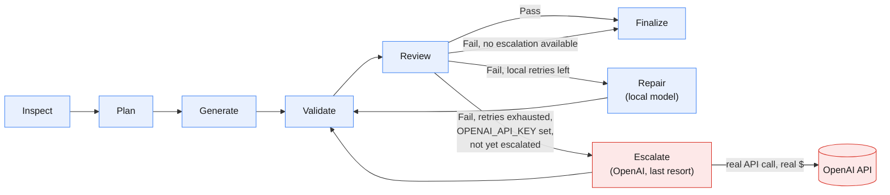

# Agentic Code Generation Workflow

Python/LangGraph agent that reads a natural-language spec (`spec.txt`) and
generates a React + TypeScript app into the provided boilerplate, validating
and repairing its own output.

## LLM orchestration



Blue = local Ollama calls (free, tried first, every time). Red = the one
step that leaves the machine — `Escalate` only fires once every local
retry (`--max-retries`) has failed, and only if `OPENAI_API_KEY` is set;
it hits the real OpenAI API for the still-broken files, at most once per
run. See [`graph.py`](graph.py) for the actual node/edge definitions this
diagram mirrors.

## 1. Install the agent (venv)

Windows (PowerShell):
```bash
python -m venv .venv
.\.venv\Scripts\Activate.ps1
pip install -r requirements.txt
copy .env.example .env
```

macOS/Linux:
```bash
python3 -m venv .venv
source .venv/bin/activate
pip install -r requirements.txt
cp .env.example .env
```

Then edit `.env`:

- **Fastest path (no local model download):** set both
  `CODE_GENERATOR_MODEL` and `CODE_REVIEW_MODEL` to an OpenAI model id
  (e.g. `gpt-4o-mini` — any name without a `:`) and fill in
  `OPENAI_API_KEY`. No Ollama needed at all.
- **Local path:** leave the Ollama tag defaults (e.g.
  `qwen2.5-coder:14b`) and run `ollama pull <that model>` first — needs
  Ollama installed and `ollama serve` running. If the model isn't pulled,
  the agent fails immediately with a clear message telling you what to
  pull or which env var to change — it won't hang or crash.

`OPENAI_API_KEY` is also optional on top of either path above: if set,
the repair loop gets one last-resort attempt on OpenAI (`OPENAI_MODEL`)
after local retries are exhausted and still failing — free/local is
always tried first, OpenAI only spends real tokens as a final fallback,
at most once per run. Leave it unset to skip escalation entirely.
`Finalize`'s cost estimate only ever prices real OpenAI token usage
(Ollama is always $0); set `OPENAI_PRICE_PER_1K_TOKENS` to your account's
actual billed rate for an accurate number — the default is a placeholder.

## 2. Run the agent

```bash
python agent.py --spec spec.txt --output generated-app
```

Options: `--boilerplate PATH` (default `Fullstack-Coding-Challenge-main`),
`--max-retries N` (default `2`).

## 3. Run the generated frontend

```bash
cd generated-app
npm install
npm run dev
npm run typecheck
npm run test
```
