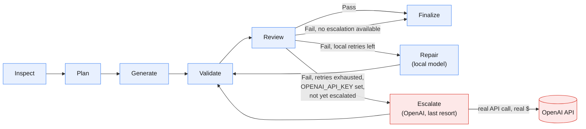

# Agentic Code Generation Workflow

Python/LangGraph agent that reads a natural-language spec (`spec.txt`) and
generates a React + TypeScript app into the provided boilerplate, validating
and repairing its own output.

## LLM orchestration



Blue = local Ollama calls (free, tried first, every time). Red = the one
step that leaves the machine — `Escalate` only fires once every local
retry (`--max-retries`) has failed, and only if `OPENAI_API_KEY` is set;
it hits the real OpenAI API for the still-broken files, at most once per
run. See [`graph.py`](graph.py) for the actual node/edge definitions this
diagram mirrors.

## Models used to build this

Developed and tested against:

- **`qwen2.5-coder:14b`** (local, via Ollama) for both `CODE_GENERATOR_MODEL`
  and `CODE_REVIEW_MODEL` — free, used for every Plan/Generate/Review/Repair
  call.
- **`gpt-5.6-luna`** (OpenAI) as `OPENAI_MODEL` — used only for the
  one-time last-resort `Escalate` step (red in the diagram above), after
  local retries are exhausted.

Neither is hardcoded. An examiner can:
- **Use different local models** — `ollama pull <model>` and point
  `CODE_GENERATOR_MODEL`/`CODE_REVIEW_MODEL` at its tag.
- **Skip Ollama and run 100% on OpenAI** — set both `CODE_GENERATOR_MODEL`
  and `CODE_REVIEW_MODEL` to an OpenAI model id (any name without a `:`)
  and supply `OPENAI_API_KEY`. `LLMClientFactory` (`llm.py`) routes purely
  by that naming convention, so this is a `.env` change, not a code
  change — Ollama doesn't even need to be installed. One consequence:
  if the primary roles are already OpenAI, every `Repair` attempt also
  spends real tokens, not just the one-time `Escalate` — "free local
  retries first" only applies when Ollama is the primary.

## 1. Install the agent (venv)

Windows (PowerShell):
```bash
python -m venv .venv
.\.venv\Scripts\Activate.ps1
pip install -r requirements.txt
copy .env.example .env
```

macOS/Linux:
```bash
python3 -m venv .venv
source .venv/bin/activate
pip install -r requirements.txt
cp .env.example .env
```

Then edit `.env`:

- **Fastest path (no local model download):** set both
  `CODE_GENERATOR_MODEL` and `CODE_REVIEW_MODEL` to an OpenAI model id
  (e.g. `gpt-4o-mini` — any name without a `:`) and fill in
  `OPENAI_API_KEY`. No Ollama needed at all.
- **Local path:** leave the Ollama tag defaults (e.g.
  `qwen2.5-coder:14b`) and run `ollama pull <that model>` first — needs
  Ollama installed and `ollama serve` running. If the model isn't pulled,
  the agent fails immediately with a clear message telling you what to
  pull or which env var to change — it won't hang or crash.

`OPENAI_API_KEY` is also optional on top of either path above: if set,
the repair loop gets one last-resort attempt on OpenAI (`OPENAI_MODEL`)
after local retries are exhausted and still failing — free/local is
always tried first, OpenAI only spends real tokens as a final fallback,
at most once per run. Leave it unset to skip escalation entirely.
`Finalize`'s cost estimate uses the exact input/output token counts each
API returns (not an estimate) and prices only real OpenAI usage — Ollama
is always $0. Set `OPENAI_INPUT_PRICE_PER_1M` / `OPENAI_OUTPUT_PRICE_PER_1M`
to match whichever model `OPENAI_MODEL` actually points at (see
`.env.example` for the per-tier rates).

## 2. Run the agent

```bash
python agent.py --spec spec.txt --output generated-app
```

Options: `--boilerplate PATH` (default `Fullstack-Coding-Challenge-main`),
`--max-retries N` (default `2`).

## Reading the logs

Every line is `[HH:MM:SS] STAGE    message` — the tag tells you which part
of the pipeline is running. Most stages are a LangGraph node from
[`graph.py`](graph.py) (the same nodes as the diagram above); `FACTORY`
and `LLM` are sub-steps that happen *inside* whichever node is currently
running (building/calling an `LLMClient`), and `ROUTE` is the conditional
edge deciding what runs next — none of those three have a node of their
own.

| Stage | Meaning | LangGraph node? |
|---|---|---|
| `START` / `SCAFFOLD` | CLI setup: copy the boilerplate, `npm install` — before the graph runs | No |
| `INSPECT` | Reads the boilerplate once, builds the shared context block | `inspect_node` |
| `FACTORY` | `LLMClientFactory` picking a client from `.env` | No — called from inside a node |
| `PLAN` | Spec → ordered, dependency-aware file tasks (JSON) | `plan_node` |
| `LLM` | One HTTP call to a model completing (real token counts, time) | No — from `LLMClient.complete()` |
| `GENERATE` | One file written | `generate_node` |
| `VALIDATE` | Real `npm run typecheck` / `npm run test` inside the generated app | `validate_node` |
| `REVIEW` | Second LLM checks files + spec + validation output | `review_node` |
| `ROUTE` | Decides: `finalize`, `repair`, or `escalate` | conditional edge, not a node |
| `REPAIR` | Rewrites only the files implicated by the failure (local model) | `repair_node` |
| `ESCALATE` | Same as Repair, forced to OpenAI, at most once per run | `escalate_node` |
| `FINALIZE` | Closing summary: files, validation, retries, real token/cost usage | `finalize_node` |
| `DONE` / `ERROR` | CLI exit, after the graph has already returned | No |

A real, unedited run — `CODE_GENERATOR_MODEL=gpt-5.6-terra`,
`CODE_REVIEW_MODEL=gpt-5.6-luna` (see "Models used to build this" for how
to point `.env` at OpenAI instead of Ollama) — one repair round, no
escalation needed, and a clean `PASS`:

```
[16:01:55] START    spec=spec.txt output=generated-app boilerplate=Fullstack-Coding-Challenge-main max_retries=2
[16:01:55] SCAFFOLD copying Fullstack-Coding-Challenge-main -> generated-app
[16:02:01] SCAFFOLD npm install (this can take a minute)...
[16:02:32] INSPECT  read 12 files, built boilerplate context (3551 chars)
[16:02:32] FACTORY  generator -> openai:gpt-5.6-terra
[16:02:32] PLAN     decomposing spec into ordered file tasks...
[16:03:07] LLM      generator -> openai:gpt-5.6-terra (ok, 2777+889 tok, 34.4s)
[16:03:07] PLAN     planned 6 file(s): src/hooks/useCars.ts, src/components/CarCard.tsx, src/components/AddCarForm.tsx, src/components/CarList.tsx, src/App.tsx, src/__tests__/CarList.test.tsx
[16:03:07] FACTORY  generator -> openai:gpt-5.6-terra
[16:03:18] LLM      generator -> openai:gpt-5.6-terra (ok, 2625+129 tok, 11.8s)
[16:03:18] GENERATE src/hooks/useCars.ts
...                                              (one FACTORY+LLM+GENERATE per planned file)
[16:05:25] GENERATE src/__tests__/CarList.test.tsx
[16:05:25] VALIDATE npm run typecheck
[16:05:29] VALIDATE typecheck FAIL
[16:05:29] VALIDATE npm run test
[16:05:53] VALIDATE test OK
[16:05:53] FACTORY  reviewer -> openai:gpt-5.6-luna
[16:05:53] REVIEW   checking generated files against the spec + validation output...
[16:05:55] LLM      reviewer -> openai:gpt-5.6-luna (ok, 3740+96 tok, 2.5s)
[16:05:55] REVIEW   FAIL (1 issue(s))
[16:05:55] FACTORY  generator -> openai:gpt-5.6-terra
[16:06:00] LLM      repair -> openai:gpt-5.6-terra (ok, 3440+587 tok, 4.7s)
[16:06:00] REPAIR   retry 1/2 -> src/components/CarList.tsx
[16:06:00] VALIDATE npm run typecheck
[16:06:03] VALIDATE typecheck OK
[16:06:03] VALIDATE npm run test
[16:06:07] VALIDATE test OK
[16:06:07] FACTORY  reviewer -> openai:gpt-5.6-luna
[16:06:07] REVIEW   checking generated files against the spec + validation output...
[16:06:14] LLM      reviewer -> openai:gpt-5.6-luna (ok, 3590+529 tok, 6.9s)
[16:06:14] REVIEW   PASS (0 issue(s))
[16:06:14] FINALIZE SUCCESS — 6 file(s), typecheck=OK, test=OK, review=PASS, retries=1, escalated=False
[16:06:14] FINALIZE usage: ollama 0 tok / $0  |  openai 31769 in + 5932 out tok / ~$0.0135 (@ $0.20/1M in, $1.20/1M out — override with OPENAI_INPUT_PRICE_PER_1M/OPENAI_OUTPUT_PRICE_PER_1M)
[16:06:14] FINALIZE by stage: generator=7call/25719tok/openai repair=1call/4027tok/openai reviewer=2call/7955tok/openai
[16:06:14] DONE     run `cd generated-app && npm run dev` to try the app
```

Real cost: **$0.0135**, cheap mainly because it converged in one repair
round — fewer retries beats a lower per-token rate. For comparison, a
much larger *local* model (27B, Q3-quantized to fit 16GB VRAM) finished
the same spec with a few test failures still open — bigger isn't
automatically better locally once quantization is squeezed that hard.
If local retries run out and `OPENAI_API_KEY` is set, `Escalate` runs
instead of stopping; either way `Finalize` reports honestly (`SUCCESS`
or exactly what's still open) rather than faking a pass.

## 3. Run the generated frontend

```bash
cd generated-app
npm install
npm run dev
npm run typecheck
npm run test
```

## Anticipated questions

**Why LangGraph?** Explicit, inspectable state: one typed `AgentState`
flows through named nodes, and the only branching logic (retry until
clean or out of budget) is a single `add_conditional_edges` call. The
diagram above is literally `build_graph()`'s shape.

**How was the spec decomposed into a plan?** `plan_node` asks the
generator model for a JSON list of `{path, description, depends_on}`,
topologically sorted (`tools.topo_sort`) into dependency order. Fully
spec-driven — a different `spec.txt` produces a different plan through
the same code.

**What hardware did you run this on?** RTX 3080 (16GB VRAM) + 32GB RAM,
running Ollama for every real test in this project — that ceiling drives
the model-selection tradeoffs below.

**Why Ollama as the primary model?** Free and private during iteration,
and the brief allows any provider.

**Why one model for both generator and reviewer?** Started with two
different local models; alternating between them forced Ollama to
reload weights every call, causing 100–200s+ timeouts. One resident
model fixed that (calls dropped to 5–50s) — the tradeoff is Review is
no longer a different model's opinion, just the same model with a
different prompt.

**Why no automatic fallback between Ollama and OpenAI?** Predictability:
`LLMClientFactory` fails fast with a clear message instead of silently
switching providers. `Escalate` is the one deliberate, opt-in,
once-per-run exception.

**Is the self-validation real?** Two layers: mechanical (real `npm run
typecheck`/`test`) and semantic (a second LLM reviewing files against
the spec) — the second catches things that compile and pass but still
miss the spec.

**How does error recovery work end to end?** Layered, each exercised by
a real bug: malformed JSON gets one corrective retry, network errors get
one retry, failed validation sends only the implicated files through
`Repair`, exhausted retries trigger one `Escalate` if `OPENAI_API_KEY`
is set, and `Finalize` always reports the true outcome.

**How do you avoid spec memorization?** No domain concept ("Car", etc.)
appears anywhere in the agent's own code — only in `spec.txt`. Swap the
spec and the same code runs unmodified.

**Why skip the "Optional Extras"?** Deliberate: spend the time on agent
architecture instead of low-value bonus features. Adding them back is
just new `spec.txt` lines.

**Approximate cost per run?** $0 locally, the common case. If `Escalate`
fires, roughly a few cents to $0.20–0.30 based on real runs.

**What would you improve with more time?** Parallelize independent file
generation, a cheap static check before spending an LLM call on
regex-detectable issues, cache LLM responses across dev runs, revisit
two-model Review with more VRAM.

**What was this agent's code written with?** Claude (Claude Code),
iteratively against real runs — several `fix:` commits exist because a
real run surfaced a real bug that got diagnosed and fixed at the root.
