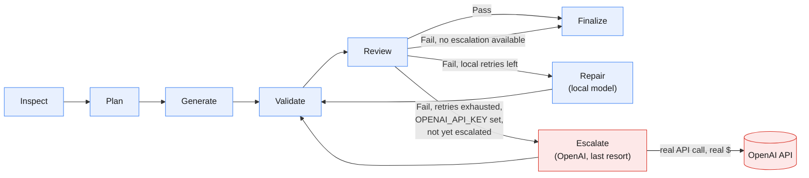

# Agentic Code Generation Workflow

Python/LangGraph agent that reads a natural-language spec (`spec.txt`) and
generates a React + TypeScript app into the provided boilerplate, validating
and repairing its own output.

## LLM orchestration



Blue = local Ollama calls (free, tried first, every time). Red = the one
step that leaves the machine — `Escalate` only fires once every local
retry (`--max-retries`) has failed, and only if `OPENAI_API_KEY` is set;
it hits the real OpenAI API for the still-broken files, at most once per
run. See [`graph.py`](graph.py) for the actual node/edge definitions this
diagram mirrors.

## Models used to build this

Developed and tested against:

- **`qwen2.5-coder:14b`** (local, via Ollama) for both `CODE_GENERATOR_MODEL`
  and `CODE_REVIEW_MODEL` — free, used for every Plan/Generate/Review/Repair
  call.
- **`gpt-5.6-luna`** (OpenAI) as `OPENAI_MODEL` — used only for the
  one-time last-resort `Escalate` step (red in the diagram above), after
  local retries are exhausted.

Neither is hardcoded. An examiner can:
- **Use different local models** — `ollama pull <model>` and point
  `CODE_GENERATOR_MODEL`/`CODE_REVIEW_MODEL` at its tag.
- **Skip Ollama and run 100% on OpenAI** — set both `CODE_GENERATOR_MODEL`
  and `CODE_REVIEW_MODEL` to an OpenAI model id (any name without a `:`)
  and supply `OPENAI_API_KEY`. `LLMClientFactory` (`llm.py`) routes purely
  by that naming convention, so this is a `.env` change, not a code
  change — Ollama doesn't even need to be installed. One consequence:
  if the primary roles are already OpenAI, every `Repair` attempt also
  spends real tokens, not just the one-time `Escalate` — "free local
  retries first" only applies when Ollama is the primary.

## 1. Install the agent (venv)

Windows (PowerShell):
```bash
python -m venv .venv
.\.venv\Scripts\Activate.ps1
pip install -r requirements.txt
copy .env.example .env
```

macOS/Linux:
```bash
python3 -m venv .venv
source .venv/bin/activate
pip install -r requirements.txt
cp .env.example .env
```

Then edit `.env`:

- **Fastest path (no local model download):** set both
  `CODE_GENERATOR_MODEL` and `CODE_REVIEW_MODEL` to an OpenAI model id
  (e.g. `gpt-4o-mini` — any name without a `:`) and fill in
  `OPENAI_API_KEY`. No Ollama needed at all.
- **Local path:** leave the Ollama tag defaults (e.g.
  `qwen2.5-coder:14b`) and run `ollama pull <that model>` first — needs
  Ollama installed and `ollama serve` running. If the model isn't pulled,
  the agent fails immediately with a clear message telling you what to
  pull or which env var to change — it won't hang or crash.

`OPENAI_API_KEY` is also optional on top of either path above: if set,
the repair loop gets one last-resort attempt on OpenAI (`OPENAI_MODEL`)
after local retries are exhausted and still failing — free/local is
always tried first, OpenAI only spends real tokens as a final fallback,
at most once per run. Leave it unset to skip escalation entirely.
`Finalize`'s cost estimate uses the exact input/output token counts each
API returns (not an estimate) and prices only real OpenAI usage — Ollama
is always $0. Rates default to GPT-5.6 Luna's real published pricing
($0.20/1M in, $1.20/1M out); set `OPENAI_INPUT_PRICE_PER_1M` /
`OPENAI_OUTPUT_PRICE_PER_1M` if `OPENAI_MODEL` points at Sol or Terra
instead (see `.env.example` for their rates).

## 2. Run the agent

```bash
python agent.py --spec spec.txt --output generated-app
```

Options: `--boilerplate PATH` (default `Fullstack-Coding-Challenge-main`),
`--max-retries N` (default `2`).

## Reading the logs

Every line is `[HH:MM:SS] STAGE    message` — the tag tells you which part
of the pipeline is running. Most stages are a LangGraph node from
[`graph.py`](graph.py) (the same nodes as the diagram above); `FACTORY`
and `LLM` are sub-steps that happen *inside* whichever node is currently
running (building/calling an `LLMClient`), and `ROUTE` is the conditional
edge deciding what runs next — none of those three have a node of their
own.

| Stage | Meaning | LangGraph node? |
|---|---|---|
| `START` / `SCAFFOLD` | CLI setup: copy the boilerplate, `npm install` — before the graph runs | No |
| `INSPECT` | Reads the boilerplate once, builds the shared context block | `inspect_node` |
| `FACTORY` | `LLMClientFactory` picking a client from `.env` | No — called from inside a node |
| `PLAN` | Spec → ordered, dependency-aware file tasks (JSON) | `plan_node` |
| `LLM` | One HTTP call to a model completing (real token counts, time) | No — from `LLMClient.complete()` |
| `GENERATE` | One file written | `generate_node` |
| `VALIDATE` | Real `npm run typecheck` / `npm run test` inside the generated app | `validate_node` |
| `REVIEW` | Second LLM checks files + spec + validation output | `review_node` |
| `ROUTE` | Decides: `finalize`, `repair`, or `escalate` | conditional edge, not a node |
| `REPAIR` | Rewrites only the files implicated by the failure (local model) | `repair_node` |
| `ESCALATE` | Same as Repair, forced to OpenAI, at most once per run | `escalate_node` |
| `FINALIZE` | Closing summary: files, validation, retries, real token/cost usage | `finalize_node` |
| `DONE` / `ERROR` | CLI exit, after the graph has already returned | No |

A real, unedited run — `CODE_GENERATOR_MODEL=gpt-5.6-terra`,
`CODE_REVIEW_MODEL=gpt-5.6-luna` (see "Models used to build this" for how
to point `.env` at OpenAI instead of Ollama) — one repair round, no
escalation needed, and a clean `PASS`:

```
[16:01:55] START    spec=spec.txt output=generated-app boilerplate=Fullstack-Coding-Challenge-main max_retries=2
[16:01:55] SCAFFOLD copying Fullstack-Coding-Challenge-main -> generated-app
[16:02:01] SCAFFOLD npm install (this can take a minute)...
[16:02:32] INSPECT  read 12 files, built boilerplate context (3551 chars)
[16:02:32] FACTORY  generator -> openai:gpt-5.6-terra
[16:02:32] PLAN     decomposing spec into ordered file tasks...
[16:03:07] LLM      generator -> openai:gpt-5.6-terra (ok, 2777+889 tok, 34.4s)
[16:03:07] PLAN     planned 6 file(s): src/hooks/useCars.ts, src/components/CarCard.tsx, src/components/AddCarForm.tsx, src/components/CarList.tsx, src/App.tsx, src/__tests__/CarList.test.tsx
[16:03:07] FACTORY  generator -> openai:gpt-5.6-terra
[16:03:18] LLM      generator -> openai:gpt-5.6-terra (ok, 2625+129 tok, 11.8s)
[16:03:18] GENERATE src/hooks/useCars.ts
...                                              (one FACTORY+LLM+GENERATE per planned file)
[16:05:25] GENERATE src/__tests__/CarList.test.tsx
[16:05:25] VALIDATE npm run typecheck
[16:05:29] VALIDATE typecheck FAIL
[16:05:29] VALIDATE npm run test
[16:05:53] VALIDATE test OK
[16:05:53] FACTORY  reviewer -> openai:gpt-5.6-luna
[16:05:53] REVIEW   checking generated files against the spec + validation output...
[16:05:55] LLM      reviewer -> openai:gpt-5.6-luna (ok, 3740+96 tok, 2.5s)
[16:05:55] REVIEW   FAIL (1 issue(s))
[16:05:55] FACTORY  generator -> openai:gpt-5.6-terra
[16:06:00] LLM      repair -> openai:gpt-5.6-terra (ok, 3440+587 tok, 4.7s)
[16:06:00] REPAIR   retry 1/2 -> src/components/CarList.tsx
[16:06:00] VALIDATE npm run typecheck
[16:06:03] VALIDATE typecheck OK
[16:06:03] VALIDATE npm run test
[16:06:07] VALIDATE test OK
[16:06:07] FACTORY  reviewer -> openai:gpt-5.6-luna
[16:06:07] REVIEW   checking generated files against the spec + validation output...
[16:06:14] LLM      reviewer -> openai:gpt-5.6-luna (ok, 3590+529 tok, 6.9s)
[16:06:14] REVIEW   PASS (0 issue(s))
[16:06:14] FINALIZE SUCCESS — 6 file(s), typecheck=OK, test=OK, review=PASS, retries=1, escalated=False
[16:06:14] FINALIZE usage: ollama 0 tok / $0  |  openai 31769 in + 5932 out tok / ~$0.0135 (@ $0.20/1M in, $1.20/1M out — override with OPENAI_INPUT_PRICE_PER_1M/OPENAI_OUTPUT_PRICE_PER_1M)
[16:06:14] FINALIZE by stage: generator=7call/25719tok/openai repair=1call/4027tok/openai reviewer=2call/7955tok/openai
[16:06:14] DONE     run `cd generated-app && npm run dev` to try the app
```

Note the real cost: **$0.0135** for a full run, since `gpt-5.6-terra`/
`gpt-5.6-luna` are cheap per-token and this converged in a single repair
round — much less than a rough per-token guess would suggest, because
fewer retries (needing fewer calls) matters more than the per-token rate
does.

**For comparison**, the same spec against a much larger *local* model —
a community 27B parameter, Q3-quantized build squeezed to just fit a
16GB GPU (`SetneufPT/Qwen3.6-27B-MTP_Q3_32K_16GB-GPU`) — did not reach
this clean a result. It ran to completion but finished with a few
simple test failures still open, unlike the OpenAI run above. Bigger
isn't automatically better locally: an aggressive Q3 quantization
squeezed to just barely fit 16GB trades real per-weight quality for
parameter count, and can end up behind either a well-quantized smaller
model (`qwen2.5-coder:14b`, Q4_K_M) or a hosted model with no such
VRAM ceiling at all.

If `Review` still fails after every local retry and `OPENAI_API_KEY` is
set, you'd see `ROUTE ... trying one escalation`, then a block of
`ESCALATE openai:<model> -> <path>` lines instead of `REPAIR`, before the
final `VALIDATE`/`REVIEW`/`FINALIZE`. In practice, a 14B local model
doesn't always reach a full `PASS` within the default retry budget — that
is a known, documented limitation, not a bug: `Finalize` always reports
honestly either way (`SUCCESS` vs `FINISHED WITH OPEN ISSUES` plus exactly
what's unresolved), and the process exit code reflects it.

## 3. Run the generated frontend

```bash
cd generated-app
npm install
npm run dev
npm run typecheck
npm run test
```

## Anticipated questions

**Why LangGraph instead of a hand-rolled loop or another framework?**
I wanted the state machine explicit and inspectable: one typed
`AgentState` dict flows through named nodes instead of ad-hoc globals,
and the one part of this pipeline that actually needs branching — retry
until clean or out of budget — is a single `add_conditional_edges` call
instead of a hand-written `while` loop with flags. The mermaid diagram
in this README isn't documentation drifting from the code, it's the
same shape as `build_graph()` in `graph.py`.

**How was the spec decomposed into a plan?**
`plan_node` sends the spec plus the boilerplate context (file tree,
`types.ts`, `queries.ts`) to the generator model with a JSON schema in
the prompt: an ordered list of `{path, description, depends_on}`. The
reply is parsed, validated, and topologically sorted
(`tools.topo_sort`, Kahn's algorithm) so files come out in dependency
order — hooks before the components that use them, components before
`App.tsx`, everything before its test. Nothing in this step is
hardcoded to the Car Inventory spec; a different `spec.txt` produces a
different plan through the same code path.

**What hardware did you actually run this on?**
A laptop with an **RTX 3080 (16GB VRAM) and 32GB system RAM**, running
Ollama locally for every real test run in this project's history. That
ceiling is also why the model-selection story below matters — 16GB
isn't much headroom for juggling multiple large local models at once.

**Why Ollama as the primary model instead of going straight to a hosted API?**
Free and private during iteration — every real run in this repo used it
at $0 — and the brief explicitly allows "Anthropic, OpenAI, or any
provider, use what you're strongest with."

**Why one model (`qwen2.5-coder:14b`) for both generator and reviewer, not two different ones?**
That wasn't the original plan — I started with two different local
models, one per role. On that 16GB-VRAM machine, alternating between two
different multi-GB models on every call forced Ollama to unload/reload
weights each time, and repair rounds started hitting 100–200s+ timeouts
under sustained load. Pointing both roles at one resident model removed
that failure class entirely (calls dropped from 60–100s+ to 5–50s). The
tradeoff is real: review is no longer "a second opinion from a different
model family," just the same model re-reading its own output with a
different prompt/role — documented, not hidden.

**Why no automatic fallback between Ollama and OpenAI for the primary roles?**
Predictability during debugging. If `CODE_GENERATOR_MODEL`/
`CODE_REVIEW_MODEL` can't be used, `LLMClientFactory` raises immediately
with a clear message (missing key, model not pulled, Ollama unreachable)
instead of silently retrying on a different provider with different
cost/behavior. `Escalate` is the one deliberate exception, and it's
opt-in, capped at once per run, and only ever a last resort — not a
fallback in the same sense.

**Is the self-validation real, or does the agent just ask an LLM "did I do a good job"?**
Both, on purpose, as two independent layers. Mechanical: `npm run
typecheck` and `npm run test` run as real subprocesses against the real
generated app — no invented test framework. Semantic: a second LLM call
(`review_node`) reads the spec, the generated files, and that mechanical
output, and returns a structured PASS/FAIL with per-file issues — this
is what catches something that compiles and passes its tests but still
doesn't match the spec (e.g. a sort control wired to the wrong fields).

**How does error recovery actually work end to end?**
Layered, and every layer was exercised by a real failure during
development: a malformed JSON reply from Plan/Review gets one corrective
retry with the exact parse error fed back in; a transient network error
mid-call gets one same-provider retry plus a raised timeout; a failed
typecheck/test/review sends only the implicated files (parsed from the
tool output, not the whole app) through `Repair`, looping back to
`Validate`, up to `--max-retries`; if that's exhausted and
`OPENAI_API_KEY` is set, one `Escalate` pass tries again on OpenAI; if
it's still broken after that, `Finalize` says so plainly and the exit
code reflects it — it never reports success it didn't earn.

**How do you keep this from just being spec memorization?**
Nothing in `agent.py`, `graph.py`, `prompts.py`, or `tools.py` mentions
"Car," "CarCard," or any other domain concept — the only spec-specific
content anywhere in this repo is `spec.txt` itself. Swap it for a
different app spec against the same boilerplate shape, and the same
code runs unmodified, because the planner derives the file list from
whatever spec it's handed, not from a template.

**Why skip the brief's "Optional Extras" (GetCar-by-id, year filter, useCarFilters)?**
A deliberate call to spend the available time on the agentic
architecture (the four primary evaluation criteria) rather than
low-value bonus app features. Adding them back is now just new lines in
`spec.txt` — no agent changes required, since the planner is fully
spec-driven.

**What's the approximate cost per run?**
$0 when everything resolves locally — the common case. If `Escalate`
fires, it's typically a handful of files re-sent to `gpt-5.6-luna` once,
priced from that model's real published rate ($0.20/1M input, $1.20/1M
output) using the exact token counts each API call returns — a few
cents to roughly $0.20–0.30 in the runs observed while building this.

**What would you improve with more time?**
Parallelize generation of files with no dependency relationship
(currently sequential, on purpose, for simplicity); a cheap static check
(e.g. "more than one `export default`?") before spending an LLM call on
something regex-detectable; cache LLM responses across development runs
to cut cost/time while iterating on the agent itself; revisit a
two-model Review setup on a machine with more VRAM, now that the
single-model tradeoff is understood and chosen rather than forced.

**What was this agent's own code written with?**
Claude (Claude Code) — used throughout, iteratively, testing against
real local Ollama runs and fixing what broke rather than writing it in
one pass. The git history is that process: each commit is a working
increment, and several of the `fix:` commits exist specifically because
a real run surfaced a real bug (a Windows console encoding crash, a
timeout under model-switching load, a test asserting on the wrong DOM
structure) that got diagnosed from the actual failing output and fixed
at the root, not guessed at.
