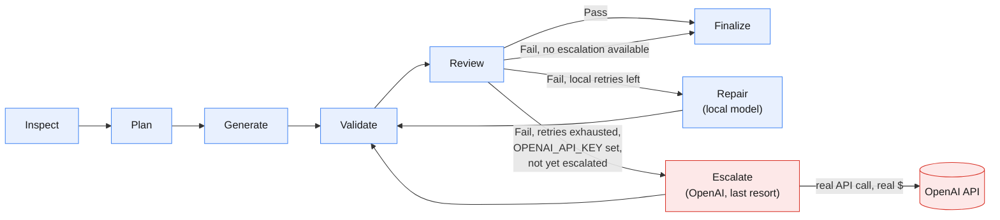

# Agentic Code Generation Workflow

Python/LangGraph agent that reads a natural-language spec (`spec.txt`) and
generates a React + TypeScript app into the provided boilerplate, validating
and repairing its own output.

## LLM orchestration



Blue = local Ollama calls (free, tried first, every time). Red = the one
step that leaves the machine — `Escalate` only fires once every local
retry (`--max-retries`) has failed, and only if `OPENAI_API_KEY` is set;
it hits the real OpenAI API for the still-broken files, at most once per
run. See [`graph.py`](graph.py) for the actual node/edge definitions this
diagram mirrors.

## Models used to build this

Developed and tested against:

- **`qwen2.5-coder:14b`** (local, via Ollama) for both `CODE_GENERATOR_MODEL`
  and `CODE_REVIEW_MODEL` — free, used for every Plan/Generate/Review/Repair
  call.
- **`gpt-5.6-luna`** (OpenAI) as `OPENAI_MODEL` — used only for the
  one-time last-resort `Escalate` step (red in the diagram above), after
  local retries are exhausted.

Neither is hardcoded. An examiner can:
- **Use different local models** — `ollama pull <model>` and point
  `CODE_GENERATOR_MODEL`/`CODE_REVIEW_MODEL` at its tag.
- **Skip Ollama and run 100% on OpenAI** — set both `CODE_GENERATOR_MODEL`
  and `CODE_REVIEW_MODEL` to an OpenAI model id (any name without a `:`)
  and supply `OPENAI_API_KEY`. `LLMClientFactory` (`llm.py`) routes purely
  by that naming convention, so this is a `.env` change, not a code
  change — Ollama doesn't even need to be installed. One consequence:
  if the primary roles are already OpenAI, every `Repair` attempt also
  spends real tokens, not just the one-time `Escalate` — "free local
  retries first" only applies when Ollama is the primary.

## 1. Install the agent (venv)

Windows (PowerShell):
```bash
python -m venv .venv
.\.venv\Scripts\Activate.ps1
pip install -r requirements.txt
copy .env.example .env
```

macOS/Linux:
```bash
python3 -m venv .venv
source .venv/bin/activate
pip install -r requirements.txt
cp .env.example .env
```

Then edit `.env`:

- **Fastest path (no local model download):** set both
  `CODE_GENERATOR_MODEL` and `CODE_REVIEW_MODEL` to an OpenAI model id
  (e.g. `gpt-4o-mini` — any name without a `:`) and fill in
  `OPENAI_API_KEY`. No Ollama needed at all.
- **Local path:** leave the Ollama tag defaults (e.g.
  `qwen2.5-coder:14b`) and run `ollama pull <that model>` first — needs
  Ollama installed and `ollama serve` running. If the model isn't pulled,
  the agent fails immediately with a clear message telling you what to
  pull or which env var to change — it won't hang or crash.

`OPENAI_API_KEY` is also optional on top of either path above: if set,
the repair loop gets one last-resort attempt on OpenAI (`OPENAI_MODEL`)
after local retries are exhausted and still failing — free/local is
always tried first, OpenAI only spends real tokens as a final fallback,
at most once per run. Leave it unset to skip escalation entirely.
`Finalize`'s cost estimate uses the exact input/output token counts each
API returns (not an estimate) and prices only real OpenAI usage — Ollama
is always $0. Rates default to GPT-5.6 Luna's real published pricing
($0.20/1M in, $1.20/1M out); set `OPENAI_INPUT_PRICE_PER_1M` /
`OPENAI_OUTPUT_PRICE_PER_1M` if `OPENAI_MODEL` points at Sol or Terra
instead (see `.env.example` for their rates).

## 2. Run the agent

```bash
python agent.py --spec spec.txt --output generated-app
```

Options: `--boilerplate PATH` (default `Fullstack-Coding-Challenge-main`),
`--max-retries N` (default `2`).

## Reading the logs

Every line is `[HH:MM:SS] STAGE    message` — the tag tells you which part
of the pipeline is running. Most stages are a LangGraph node from
[`graph.py`](graph.py) (the same nodes as the diagram above); `FACTORY`
and `LLM` are sub-steps that happen *inside* whichever node is currently
running (building/calling an `LLMClient`), and `ROUTE` is the conditional
edge deciding what runs next — none of those three have a node of their
own.

| Stage | Meaning | LangGraph node? |
|---|---|---|
| `START` / `SCAFFOLD` | CLI setup: copy the boilerplate, `npm install` — before the graph runs | No |
| `INSPECT` | Reads the boilerplate once, builds the shared context block | `inspect_node` |
| `FACTORY` | `LLMClientFactory` picking a client from `.env` | No — called from inside a node |
| `PLAN` | Spec → ordered, dependency-aware file tasks (JSON) | `plan_node` |
| `LLM` | One HTTP call to a model completing (real token counts, time) | No — from `LLMClient.complete()` |
| `GENERATE` | One file written | `generate_node` |
| `VALIDATE` | Real `npm run typecheck` / `npm run test` inside the generated app | `validate_node` |
| `REVIEW` | Second LLM checks files + spec + validation output | `review_node` |
| `ROUTE` | Decides: `finalize`, `repair`, or `escalate` | conditional edge, not a node |
| `REPAIR` | Rewrites only the files implicated by the failure (local model) | `repair_node` |
| `ESCALATE` | Same as Repair, forced to OpenAI, at most once per run | `escalate_node` |
| `FINALIZE` | Closing summary: files, validation, retries, real token/cost usage | `finalize_node` |
| `DONE` / `ERROR` | CLI exit, after the graph has already returned | No |

A representative example (trimmed, values from real runs) — one repair
round that resolves everything, no escalation needed:

```
[14:38:31] START    spec=spec.txt output=generated-app boilerplate=Fullstack-Coding-Challenge-main max_retries=2
[14:38:31] SCAFFOLD copying Fullstack-Coding-Challenge-main -> generated-app
[14:38:38] SCAFFOLD npm install (this can take a minute)...
[14:39:10] INSPECT  read 12 files, built boilerplate context (3551 chars)
[14:39:10] FACTORY  generator -> ollama:qwen2.5-coder:14b
[14:39:10] PLAN     decomposing spec into ordered file tasks...
[14:39:26] LLM      generator -> ollama:qwen2.5-coder:14b (ok, 2100+430 tok, 16.0s)
[14:39:26] PLAN     planned 5 file(s): src/hooks/useCars.ts, src/components/CarCard.tsx, ...
[14:39:26] FACTORY  generator -> ollama:qwen2.5-coder:14b
[14:39:31] LLM      generator -> ollama:qwen2.5-coder:14b (ok, 1200+310 tok, 5.0s)
[14:39:31] GENERATE src/hooks/useCars.ts
...                                              (one FACTORY+LLM+GENERATE per planned file)
[14:40:23] VALIDATE npm run typecheck
[14:40:29] VALIDATE typecheck FAIL
[14:40:29] VALIDATE npm run test
[14:41:07] VALIDATE test FAIL
[14:41:07] FACTORY  reviewer -> ollama:qwen2.5-coder:14b
[14:41:07] REVIEW   checking generated files against the spec + validation output...
[14:41:20] LLM      reviewer -> ollama:qwen2.5-coder:14b (ok, 3900+210 tok, 12.7s)
[14:41:20] REVIEW   FAIL (2 issue(s))
[14:41:20] FACTORY  generator -> ollama:qwen2.5-coder:14b
[14:41:34] LLM      repair -> ollama:qwen2.5-coder:14b (ok, 2800+340 tok, 14.4s)
[14:41:34] REPAIR   retry 1/2 -> src/components/CarCard.tsx
...                                              (one FACTORY+LLM+REPAIR per implicated file)
[14:42:22] VALIDATE npm run typecheck
[14:42:25] VALIDATE typecheck OK
[14:42:25] VALIDATE npm run test
[14:42:33] VALIDATE test OK
[14:42:33] FACTORY  reviewer -> ollama:qwen2.5-coder:14b
[14:42:40] LLM      reviewer -> ollama:qwen2.5-coder:14b (ok, 3200+90 tok, 7.5s)
[14:42:40] REVIEW   PASS (0 issue(s))
[14:42:40] FINALIZE SUCCESS — 5 file(s), typecheck=OK, test=OK, review=PASS, retries=1, escalated=False
[14:42:40] FINALIZE usage: ollama 42318 tok / $0  |  openai 0 in + 0 out tok / ~$0.0 (@ $0.20/1M in, $1.20/1M out — override with OPENAI_INPUT_PRICE_PER_1M/OPENAI_OUTPUT_PRICE_PER_1M)
[14:42:40] FINALIZE by stage: generator=6call/24800tok/ollama repair=5call/12200tok/ollama reviewer=2call/5318tok/ollama
[14:42:40] DONE     run `cd generated-app && npm run dev` to try the app
```

If `Review` still fails after every local retry and `OPENAI_API_KEY` is
set, you'd see `ROUTE ... trying one escalation`, then a block of
`ESCALATE openai:<model> -> <path>` lines instead of `REPAIR`, before the
final `VALIDATE`/`REVIEW`/`FINALIZE`. In practice, a 14B local model
doesn't always reach a full `PASS` within the default retry budget — that
is a known, documented limitation, not a bug: `Finalize` always reports
honestly either way (`SUCCESS` vs `FINISHED WITH OPEN ISSUES` plus exactly
what's unresolved), and the process exit code reflects it.

## 3. Run the generated frontend

```bash
cd generated-app
npm install
npm run dev
npm run typecheck
npm run test
```
