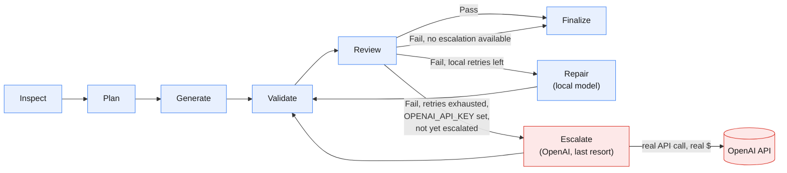

# Agentic Code Generation Workflow

Python/LangGraph agent that reads a natural-language spec (`spec.txt`) and
generates a React + TypeScript app into the provided boilerplate, validating
and repairing its own output.

## LLM orchestration



Blue = local Ollama calls (free, tried first, every time). Red = the one
step that leaves the machine — `Escalate` only fires once every local
retry (`--max-retries`) has failed, and only if `OPENAI_API_KEY` is set;
it hits the real OpenAI API for the still-broken files, at most once per
run. See [`graph.py`](graph.py) for the actual node/edge definitions this
diagram mirrors.

## 1. Install the agent (venv)

```bash
python -m venv .venv
.\.venv\Scripts\Activate.ps1
pip install -r requirements.txt
copy .env.example .env
```

Edit `.env` with the Ollama/OpenAI models to use (`CODE_GENERATOR_MODEL`,
`CODE_REVIEW_MODEL`). `OPENAI_API_KEY` is optional: if set, the repair loop
gets one last-resort attempt on OpenAI (`OPENAI_MODEL`) after local
retries are exhausted and still failing — free/local is always tried first,
OpenAI only spends real tokens as a final fallback, at most once per run.
Leave it unset to run 100% local.

## 2. Run the agent

```bash
python agent.py --spec spec.txt --output generated-app
```

Options: `--boilerplate PATH` (default `Fullstack-Coding-Challenge-main`),
`--max-retries N` (default `2`).

## 3. Run the generated frontend

```bash
cd generated-app
npm install
npm run dev
npm run typecheck
npm run test
```
